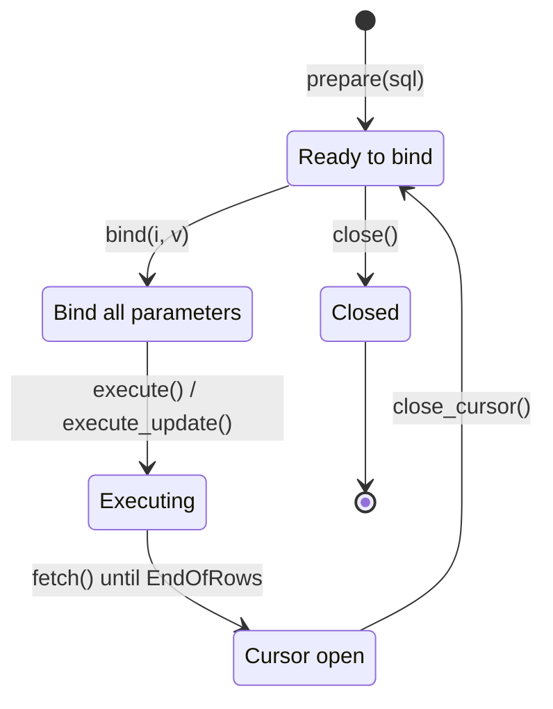

# Prepared Statements

`Connection.prepare(sql)` hands you a `Statement` — an object that represents a compiled SQL statement with *parameter markers*. You bind values to each marker, execute, and reuse the same compiled plan as many times as you like.

Two reasons to prepare:

- **Safety.** Bound parameters don't get interpolated into the SQL string, so there's no SQL injection surface. This alone is reason enough to prepare any statement that takes user-supplied input.
- **Performance.** The database parses and plans the statement once. For a statement you run thousands of times (a batch insert, a hot lookup), that's a real saving.

## Statement lifecycle

The interesting transition is `close_cursor()` — it returns the statement to the "ready to bind" state. That's what lets you batch: prepare once, bind/execute/close-cursor in a loop, close the statement when the loop's done.

## Three pages

1. [Binding Parameters](binding.md) — `ParamIndex`, every `SqlValue` constructor, `BindError`
2. [Executing](executing.md) — `execute()` vs `execute_update()`, and when to use each
3. [Reusing Statements](reuse.md) — batching inserts, iterating SELECTs, the `close_cursor()` loop
