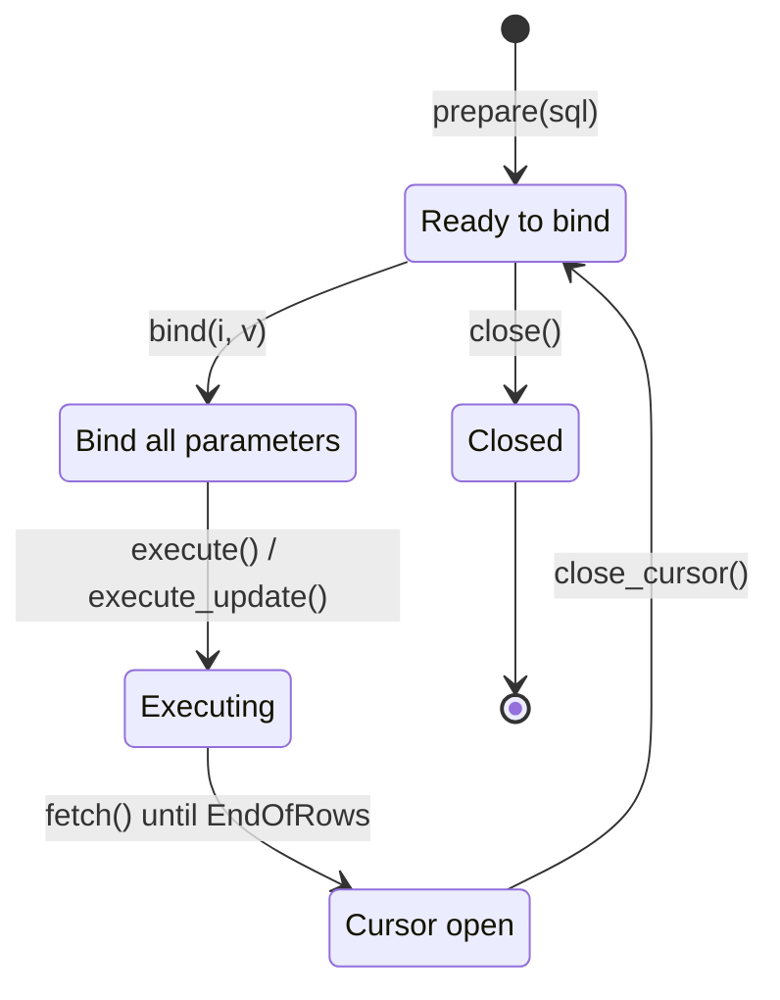

# Prepared Statements

`Connection.prepare(sql)` returns a `Statement` — a compiled SQL statement with *parameter markers*. Bind values, execute, and reuse the same compiled plan as many times as you like.

Two reasons to prepare:

- **Safety.** Bound parameters aren't interpolated into the SQL string, so there's no SQL injection surface. Reason enough on its own for anything taking user input.
- **Performance.** The database parses and plans once. For a statement run thousands of times, that's a real saving.

## Statement lifecycle

`close_cursor()` is the key transition — it returns the statement to "ready to bind", so you can batch: prepare once, bind/execute/close-cursor in a loop, close the statement at the end.

## Three pages

1. [Binding Parameters](binding.md) — `ParamIndex`, `SqlValue` constructors, `BindError`
2. [Executing](executing.md) — `execute()` vs `execute_update()`
3. [Reusing Statements](reuse.md) — batch inserts, SELECT iteration, `close_cursor()`
