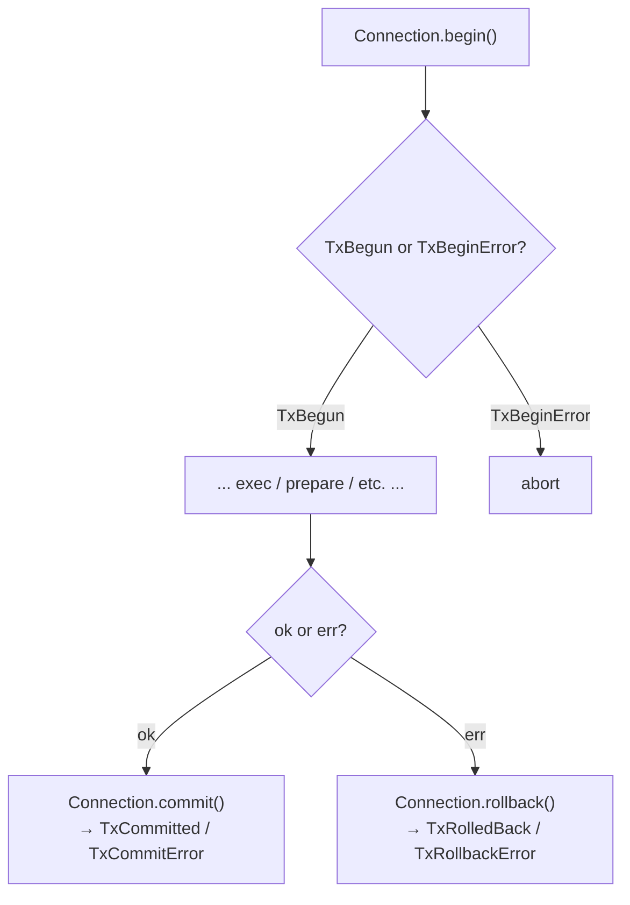

# Cheat Sheet

Every call sequence, in one page.

## Simple ad-hoc query

```text
Odbc.connect(Dsn)
  ├── Connection.query(sql) ──► Cursor
  │     ├── Cursor.fetch() ──► Row | EndOfRows | FetchError
  │     ├── Cursor.values() ──► iterator of (Row | FetchError)
  │     └── Cursor.close()
  └── Connection.close()
```

See: [Querying](../basics/querying.md).

## Prepared statement + bind + single execute

```text
Connection.prepare(sql) ──► Statement
  ├── Statement.bind(ParamIndex, SqlValue) ──► Bound | BindError
  ├── Statement.bind(...) ──► Bound | BindError
  ├── Statement.execute_update() ──► RowCount | ExecError
  └── Statement.close()
```

See: [Binding Parameters](../prepared/binding.md).

## Prepared statement + SELECT + fetch

```text
Connection.prepare(sql) ──► Statement
  ├── Statement.bind(...) as needed
  ├── Statement.execute() ──► Executed | ExecError   (opens cursor)
  │     ├── Statement.fetch() ──► Row | EndOfRows | FetchError
  │     └── Statement.values() ──► iterator of (Row | FetchError)
  ├── Statement.close_cursor()
  └── Statement.close()
```

See: [Executing](../prepared/executing.md), [Reusing Statements](../prepared/reuse.md).

## Transaction



See: [Transactions](../transactions/index.md).

## Zero-allocation fetch loop

```text
Connection.prepare(sql) ──► Statement
Statement.execute() ──► Executed
let row = MutableRow
loop:
  Statement.fetch_into(row) ──► MutableRow | EndOfRows | FetchError
Statement.close_cursor()
Statement.close()
```

See: [Zero-Allocation Fetch](../advanced/mutable-row.md).

## Async via DbSession

```text
DbSession(Dsn)
  ├── db.exec(sql, Promise[(RowCount | ExecError)])
  ├── db.query(sql, Promise[(Array[Row val] val | ExecError)])
  ├── db.begin / commit / rollback (each with its own Promise type)
  └── db.close()
```

See: [Async with DbSession](../advanced/dbsession.md).

## Cross-actor cancellation

```text
// Querying actor
let token = stmt.cancel_token()
supervisor.register(token)
stmt.execute()  // blocks

// Supervising actor
token.cancel()  // fires SQLCancel asynchronously

// Querying actor wakes with:
//   ExecError with SQLSTATE HY008 (ODBC) or 57014 (Postgres)
```

See: [Cancellation](../advanced/cancellation.md).

## Error vocabulary

| Class | Kind union |
|-------|------------|
| `ConnectError` | `EnvAllocFailed`, `DbcAllocFailed`, `DriverConnectFailed` |
| `ExecError` | `QueryError`, `ConstraintViolation`, `SyntaxError`, `ConnectionLost`, `UnboundParams`, `StatementClosed`, `ConnectionClosed`, `CursorNotOpen`, `CursorAlreadyOpen` |
| `PrepareError` | `DriverPrepareError`, `PrepareConnectionClosed` |
| `BindError` | `ParamIndexOutOfRange`, `ParamTooLarge`, `DriverRejected`, `BindStatementClosed`, `BindConnectionClosed` |
| `FetchError` | `DriverFetchError`, `ColumnTooLarge`, `UnsupportedColumnType`, `InvalidUtf8`, `FetchConnectionLost`, `FetchConnectionClosed`, `CursorClosed` |
| `TxBeginError` | `AlreadyInTransaction`, `TxBeginConnectionClosed`, `DriverTxError` |
| `TxCommitError` | verdict: `CommitFailed`, `CommitAmbiguous`, `NotInTransaction` |
| `TxRollbackError` | `RollbackNotInTransaction`, `DriverRollbackError` |

Every error has:

- `.kind()` (or `.verdict()` on `TxCommitError`) — enum-ish primitive
- `.string()` — redacted, safe to log
- `.unsafe_diag()` — raw `DiagChain`; may contain credentials

`ExecError` and `PrepareError` also have `.unsafe_sql()` — the SQL that was running.

## SqlValue variants

| Variant | Carrier | Construct | Read via |
|---------|---------|-----------|----------|
| `SqlNull` | *(primitive)* | `SqlNull` | `row.is_null(i)?` |
| `SqlBool` | `Bool` | `SqlBool(true)` | `row.bool(i)?` |
| `SqlTinyInt` | `I8` | `SqlTinyInt(12)` | `row.int(i)?` |
| `SqlSmallInt` | `I16` | `SqlSmallInt(12)` | `row.int(i)?` |
| `SqlInteger` | `I32` | `SqlInteger(12)` | `row.int(i)?` |
| `SqlBigInt` | `I64` | `SqlBigInt(12)` | `row.int(i)?` |
| `SqlFloat` | `F64` | `SqlFloat(3.14)` | `row.float(i)?` |
| `SqlText` | `String val` | `SqlText("x")` | `row.text(i)?` |
| `SqlDate` | `(I16, U16, U16)` | `SqlDate(y, m, d)` | `row.date(i)?` |
| `SqlTime` | `(U16, U16, U16)` | `SqlTime(h, m, s)` | `row.time(i)?` |
| `SqlTimestamp` | date+time+fraction | `SqlTimestamp(...)` | `row.timestamp(i)?` |
| `SqlDecimal` | `String val` | `SqlDecimal("1.23")` | `row.decimal(i)?` |

`row.int()` widens any of the four integer variants to `I64`. For the specific variant, use `row.column(i)?` and match on the result.
